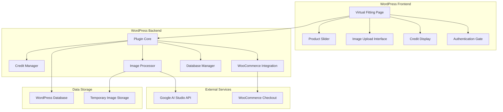

# Design Document: AI Virtual Fitting Plugin

## Overview

The AI Virtual Fitting Plugin is a WordPress plugin that integrates Google AI Studio's Gemini 2.5 Flash Image model to provide customers with virtual try-on experiences for wedding dresses. The system combines WordPress user authentication, WooCommerce product integration, credit-based usage tracking, and AI-powered image processing to create a seamless virtual fitting experience.

The plugin follows WordPress development standards and can be installed on any WordPress site with WooCommerce. It uses standard WooCommerce checkout processes for credit purchases and integrates deeply with WordPress hooks and database systems.

## Architecture

### High-Level Architecture



### Plugin Structure

```
ai-virtual-fitting/
├── ai-virtual-fitting.php          # Main plugin file
├── includes/
│   ├── class-virtual-fitting-core.php
│   ├── class-credit-manager.php
│   ├── class-image-processor.php
│   ├── class-woocommerce-integration.php
│   └── class-database-manager.php
├── admin/
│   ├── class-admin-settings.php
│   └── admin-settings-page.php
├── public/
│   ├── class-public-interface.php
│   ├── virtual-fitting-page.php
│   ├── css/virtual-fitting.css
│   └── js/virtual-fitting.js
├── assets/
│   ├── images/
│   └── icons/
└── languages/
    └── ai-virtual-fitting.pot
```

## Components and Interfaces

### 1. Plugin Core (VirtualFittingCore)

**Responsibilities:**
- Plugin initialization and activation/deactivation hooks
- Coordinate between all plugin components
- Handle WordPress integration points

**Key Methods:**
```php
class VirtualFittingCore {
    public function __construct()
    public function activate()
    public function deactivate() 
    public function init_hooks()
    public function load_dependencies()
}
```

### 2. Credit Manager (CreditManager)

**Responsibilities:**
- Track customer fitting credits
- Handle credit deduction and addition
- Integrate with WooCommerce order completion

**Key Methods:**
```php
class CreditManager {
    public function get_customer_credits($user_id)
    public function deduct_credit($user_id)
    public function add_credits($user_id, $amount)
    public function grant_initial_credits($user_id)
    public function handle_credit_purchase($order_id)
}
```

**Database Schema:**
```sql
CREATE TABLE wp_virtual_fitting_credits (
    id INT AUTO_INCREMENT PRIMARY KEY,
    user_id BIGINT NOT NULL,
    credits_remaining INT DEFAULT 0,
    total_credits_purchased INT DEFAULT 0,
    created_at DATETIME DEFAULT CURRENT_TIMESTAMP,
    updated_at DATETIME DEFAULT CURRENT_TIMESTAMP ON UPDATE CURRENT_TIMESTAMP,
    INDEX idx_user_id (user_id)
);
```

### 3. Image Processor (ImageProcessor)

**Responsibilities:**
- Handle customer image uploads and validation
- Integrate with Google AI Studio API
- Process AI responses and return results
- Manage temporary image storage

**Key Methods:**
```php
class ImageProcessor {
    public function validate_uploaded_image($file)
    public function process_virtual_fitting($customer_image, $product_images)
    public function call_gemini_api($images, $prompt)
    public function save_result_image($ai_response)
    public function cleanup_temp_files()
}
```

**Image Validation Rules:**
- Allowed formats: JPEG, PNG, WebP
- Maximum file size: 10MB
- Minimum dimensions: 512x512px
- Maximum dimensions: 2048x2048px
- MIME type validation
- File header verification

### 4. WooCommerce Integration (WooCommerceIntegration)

**Responsibilities:**
- Create and manage virtual fitting credits product
- Handle order completion hooks
- Process credit purchases through standard checkout

**Key Methods:**
```php
class WooCommerceIntegration {
    public function create_credits_product()
    public function handle_order_completed($order_id)
    public function add_credits_to_cart()
    public function validate_credits_product($order)
}
```

**WooCommerce Hooks Used:**
- `woocommerce_payment_complete` - Add credits after successful payment
- `woocommerce_order_status_completed` - Handle order completion
- `woocommerce_thankyou` - Post-purchase processing

### 5. Database Manager (DatabaseManager)

**Responsibilities:**
- Handle all database operations
- Create and manage plugin tables
- Data migration and cleanup

**Key Methods:**
```php
class DatabaseManager {
    public function create_tables()
    public function drop_tables()
    public function migrate_data()
    public function cleanup_old_data()
}
```

### 6. Public Interface (PublicInterface)

**Responsibilities:**
- Render virtual fitting page
- Handle AJAX requests
- Manage frontend interactions

**Key Methods:**
```php
class PublicInterface {
    public function render_virtual_fitting_page()
    public function handle_image_upload()
    public function handle_fitting_request()
    public function handle_image_download()
}
```

## Data Models

### Customer Credits Model
```php
class CustomerCredits {
    public $user_id;
    public $credits_remaining;
    public $total_credits_purchased;
    public $created_at;
    public $updated_at;
}
```

### Fitting Session Model
```php
class FittingSession {
    public $session_id;
    public $user_id;
    public $product_id;
    public $customer_image_path;
    public $result_image_path;
    public $status; // 'processing', 'completed', 'failed'
    public $created_at;
}
```

### Virtual Fitting Credits Product
```php
// WooCommerce Product Configuration
$product_data = [
    'name' => 'Virtual Fitting Credits - 20 Pack',
    'type' => 'simple',
    'regular_price' => '10.00',
    'virtual' => true,
    'downloadable' => false,
    'catalog_visibility' => 'hidden', // Hidden from catalog
    'meta_data' => [
        '_virtual_fitting_credits' => 20
    ]
];
```

## Correctness Properties

*A property is a characteristic or behavior that should hold true across all valid executions of a system-essentially, a formal statement about what the system should do. Properties serve as the bridge between human-readable specifications and machine-verifiable correctness guarantees.*

Now I'll analyze the acceptance criteria to determine which ones can be tested as properties:

<function_calls>
<invoke name="prework">
<parameter name="featureName">ai-virtual-fitting

### Converting EARS to Properties

Based on the prework analysis, I'll convert the testable acceptance criteria into universally quantified properties:

**Property 1: Authentication Flow Integrity**
*For any* user session state, unauthenticated users should always be redirected to login when attempting to use virtual fitting features, and authenticated users should have full access to all functionality
**Validates: Requirements 1.1, 1.2, 1.3, 1.5**

**Property 2: Product Selection Consistency**
*For any* product in the WooCommerce catalog, when displayed in the virtual fitting slider, it should show all required information (image, name, price) and enable proper selection behavior
**Validates: Requirements 2.1, 2.2, 2.3, 2.4, 2.5**

**Property 3: Image Validation Completeness**
*For any* uploaded image file, the validation system should correctly accept valid formats (JPEG, PNG, WebP) within size limits and reject all invalid formats with specific error messages
**Validates: Requirements 3.1, 3.2, 9.1**

**Property 4: AI Processing Workflow**
*For any* valid customer image and product selection, the system should send exactly one customer image and four product images to the Gemini API and display results when processing succeeds
**Validates: Requirements 3.3, 3.5**

**Property 5: Credit Lifecycle Management**
*For any* customer account, new users should receive exactly 2 free credits, successful fittings should deduct exactly 1 credit after showing results, and failed fittings should never deduct credits
**Validates: Requirements 4.1, 4.2, 4.5, 4.6**

**Property 6: Credit-Based Access Control**
*For any* customer with zero credits, the system should prevent virtual fitting access and display purchase options, while customers with credits should have unrestricted access
**Validates: Requirements 4.3, 5.1**

**Property 7: WooCommerce Integration Consistency**
*For any* completed WooCommerce order containing virtual fitting credits, the system should automatically add exactly 20 credits to the customer's account and send confirmation
**Validates: Requirements 5.2, 5.3, 5.4, 5.6, 5.7**

**Property 8: Download Functionality**
*For any* successfully completed virtual fitting, the system should provide download options in common image formats and track all download events
**Validates: Requirements 6.1, 6.2, 6.3, 6.5**

**Property 9: API Error Handling and Retry Logic**
*For any* failed API call to Google AI Studio, the system should retry up to 3 times, log all interactions, and handle rate limits appropriately
**Validates: Requirements 7.3, 7.4, 7.5, 7.6**

**Property 10: Plugin Lifecycle Management**
*For any* plugin activation, the system should create all necessary database tables and WooCommerce products, and preserve all data during deactivation
**Validates: Requirements 8.3, 8.4, 8.5, 8.6, 8.8**

**Property 11: Comprehensive Error Handling**
*For any* error condition (AI processing failures, network issues, validation errors), the system should display appropriate user-friendly messages, log detailed information, and maintain UI stability
**Validates: Requirements 3.6, 9.2, 9.3, 9.4, 9.5, 9.6**

**Property 12: Performance and Concurrency**
*For any* number of concurrent users, the system should process requests asynchronously, implement appropriate caching, and provide load feedback when necessary
**Validates: Requirements 10.1, 10.2, 10.3, 10.4, 10.5, 10.6**

## UI/UX Design Enhancements

### Three-Panel Layout Design

The plugin uses a modern three-panel layout optimized for virtual fitting workflows:

**Left Panel (400px fixed)**: Upload & Virtual Result
- Customer image upload area with drag & drop support
- Virtual fitting result display
- Floating action buttons overlaid on images
- Smooth transitions between upload and result states

**Center Panel (flexible)**: Main Product Preview
- Large product image display with gallery thumbnails
- Product image gallery with horizontal scroll
- Always maintains product focus (never shows AI results)
- Responsive image sizing and smooth transitions

**Right Panel (380px stable)**: Product Selection
- Instagram-style single-column product grid
- Category filters and search functionality
- Product cards with overlay information
- Smooth scrolling and selection animations

### Floating Interface Elements

**Upload Area Floating Buttons:**
- Change Photo (blue): Allows re-uploading customer image
- Clear Photo (red): Removes uploaded image and resets state
- Buttons appear only when image is uploaded
- Semi-transparent background with backdrop blur

**Result Area Floating Buttons:**
- Try Another (blue): Returns to upload state while preserving customer image
- Save Image (green): Downloads the virtual fitting result
- Positioned consistently for intuitive user flow

### Customer Image Persistence Architecture

**Image State Management:**
```php
// Customer image is stored with unique filename on upload
$temp_filename = 'customer_' . uniqid() . '_' . time() . '.jpg';

// Original customer image is preserved across all try-on requests
// AI processing always uses: original_customer_image + selected_product_images
// Never uses previous AI results as input for new requests
```

**UI State Preservation:**
- Upload area maintains customer image preview across sessions
- "Try Another" restores upload interface without losing image data
- Visual feedback shows "✓ Your photo is ready" when image is preserved
- Main preview panel never changes from product display to AI result

## Error Handling

### Image Upload Errors
- **Invalid Format**: "Please upload a JPEG, PNG, or WebP image file"
- **File Too Large**: "Image file must be smaller than 10MB"
- **Invalid Dimensions**: "Image must be at least 512x512 pixels"
- **Corrupted File**: "Unable to process image file. Please try a different image"

### AI Processing Errors
- **API Authentication**: "Unable to connect to AI service. Please contact administrator"
- **Rate Limiting**: "Service temporarily busy. Please try again in a few minutes"
- **Processing Timeout**: "Image processing is taking longer than expected. Please try again"
- **Invalid Response**: "Unable to process your image. Please try with a different photo"

### Credit System Errors
- **Insufficient Credits**: "You have no remaining credits. Purchase more to continue"
- **Payment Processing**: "Payment could not be processed. Please try again"
- **Database Errors**: "Unable to update your account. Please contact support"

### Network and System Errors
- **Connection Timeout**: "Connection timeout. Please check your internet connection"
- **Server Overload**: "System is experiencing high load. Estimated wait time: X minutes"
- **Maintenance Mode**: "System is temporarily unavailable for maintenance"

## Testing Strategy

### Dual Testing Approach

The plugin will use both unit testing and property-based testing to ensure comprehensive coverage:

**Unit Tests:**
- Specific examples and edge cases for each component
- Integration points between WordPress, WooCommerce, and Google AI
- Error conditions and boundary values
- Database operations and data integrity

**Property-Based Tests:**
- Universal properties that hold across all inputs using PHPUnit with Eris (PHP property testing library)
- Each property test will run minimum 100 iterations
- Tests will be tagged with feature and property references

### Property Test Configuration

Each correctness property will be implemented as a property-based test using PHPUnit and Eris:

```php
/**
 * Feature: ai-virtual-fitting, Property 1: Authentication Flow Integrity
 * For any user session state, unauthenticated users should always be redirected 
 * to login when attempting to use virtual fitting features
 */
public function testAuthenticationFlowIntegrity()
{
    $this->forAll(
        Generator\elements(['authenticated', 'unauthenticated']),
        Generator\elements(['try_on', 'upload_image', 'download_result'])
    )->then(function ($userState, $action) {
        // Property test implementation
    });
}
```

### Testing Framework Setup

- **Framework**: PHPUnit 9.x with WordPress Test Suite
- **Property Testing**: Eris library for PHP property-based testing
- **Mocking**: WP_Mock for WordPress function mocking
- **Database**: WordPress test database with WooCommerce
- **AI Service**: Mock Google AI Studio API responses for testing

### Test Coverage Requirements

- **Unit Test Coverage**: Minimum 80% code coverage
- **Property Test Coverage**: All 12 correctness properties implemented
- **Integration Tests**: WordPress hooks, WooCommerce integration, database operations
- **Performance Tests**: Concurrent user handling, image processing optimization

The testing strategy ensures both specific functionality validation through unit tests and universal correctness guarantees through property-based testing, providing comprehensive quality assurance for the AI Virtual Fitting Plugin.