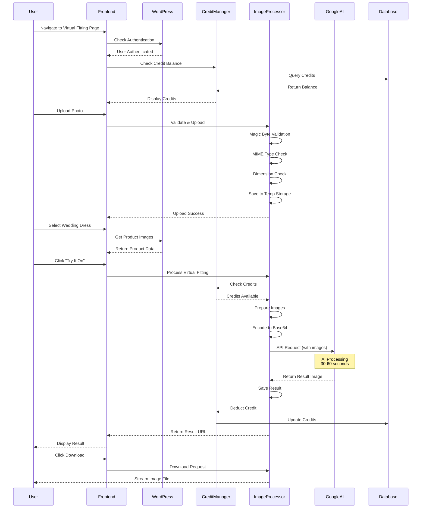
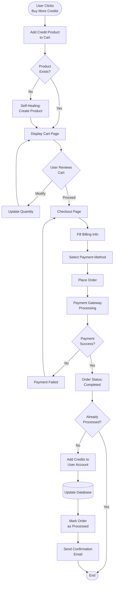
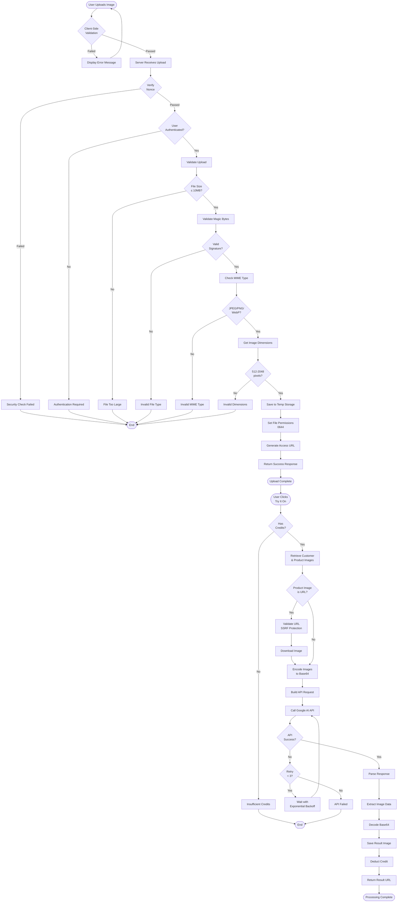
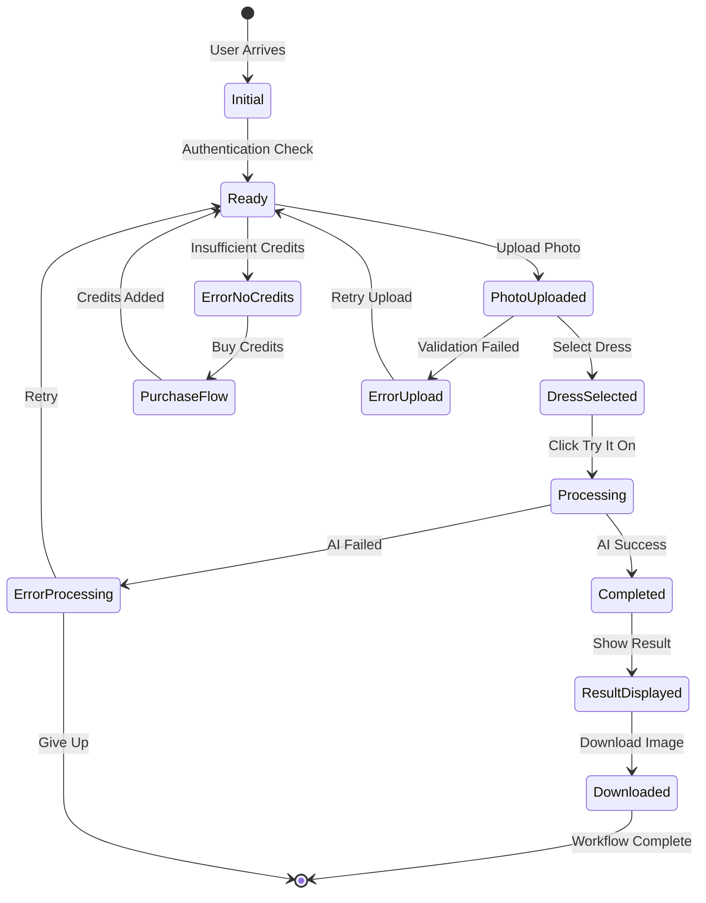
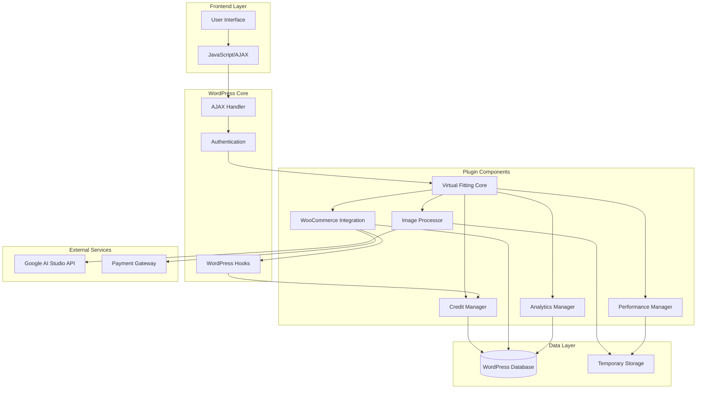

# Workflow Documentation

## Overview

This document provides detailed workflow documentation for the AI Virtual Fitting WordPress Plugin. Each workflow describes the complete user journey, system processes, state transitions, and error handling procedures.

## Table of Contents

- [Virtual Fitting Workflow](#virtual-fitting-workflow)
- [Credit Purchase Workflow](#credit-purchase-workflow)
- [Order Processing Workflow](#order-processing-workflow)
- [Image Processing Workflow](#image-processing-workflow)
- [Workflow Diagrams](#workflow-diagrams)

---

## Virtual Fitting Workflow

### Overview

The virtual fitting workflow represents the complete journey from when a customer decides to try on a wedding dress virtually to receiving and downloading their result image.

### User Journey

#### Step 1: Access Virtual Fitting Page

**User Action:**
- Customer navigates to the virtual fitting page (e.g., `/virtual-fitting`)
- Page can be accessed via menu, direct link, or product page

**System Process:**
1. WordPress loads the virtual fitting page template
2. System checks if user is logged in
3. If not logged in, redirects to login page with return URL
4. If logged in, loads the virtual fitting interface

**State:** `INITIAL`

#### Step 2: Check Credit Balance

**User Action:**
- Interface displays current credit balance
- User sees available credits and purchase option

**System Process:**
1. AJAX request to `ai_virtual_fitting_check_credits`
2. Credit Manager retrieves user's credit balance from database
3. Returns credit count to frontend
4. Interface updates credit display

**State:** `READY`

**Error Handling:**
- If database query fails, displays cached credit count or 0
- If user has no credits, shows "Buy More Credits" button prominently

#### Step 3: Upload Customer Photo

**User Action:**
- Customer clicks "Upload Photo" button
- Selects image file from device (JPEG, PNG, or WebP)
- File is uploaded to server

**System Process:**
1. JavaScript validates file before upload:
   - Checks file size (max 10MB)
   - Checks file extension (.jpg, .jpeg, .png, .webp)
2. AJAX request to `ai_virtual_fitting_upload_image`
3. Server-side validation:
   - Verifies nonce for security
   - Validates file size and type
   - Validates magic bytes (prevents file spoofing)
   - Checks image dimensions (512x512 to 2048x2048)
   - Verifies it's a valid image file
4. Saves image to temporary storage
5. Returns success with image preview URL

**State:** `PHOTO_UPLOADED`

**Error Handling:**
- **File too large:** "Image file must be smaller than 10MB"
- **Invalid format:** "Please upload a JPEG, PNG, or WebP image file"
- **Invalid dimensions:** "Image must be at least 512x512 pixels"
- **Corrupted file:** "Unable to process image file. Please try a different image"
- **Upload failed:** "Failed to save uploaded image"

**Validation Rules:**
- Maximum file size: 10MB (10,485,760 bytes)
- Minimum dimensions: 512x512 pixels
- Maximum dimensions: 2048x2048 pixels
- Allowed MIME types: image/jpeg, image/png, image/webp
- Magic byte validation required

#### Step 4: Select Wedding Dress

**User Action:**
- Customer browses available wedding dresses in product slider
- Clicks on desired dress to select it
- Can view multiple product images

**System Process:**
1. WooCommerce Integration retrieves published wedding dress products
2. Filters products with featured images
3. Displays products in interactive slider
4. User selection stores product ID and image URLs
5. Frontend validates at least one product image is available

**State:** `DRESS_SELECTED`

**Error Handling:**
- **No products available:** "No wedding dresses available. Please contact administrator"
- **Missing product images:** "Selected product has no images"
- **Product load failed:** "Unable to load wedding dresses. Please refresh the page"

#### Step 5: Process Virtual Fitting

**User Action:**
- Customer clicks "Try It On" button
- System displays processing indicator
- Estimated processing time: 30-60 seconds

**System Process:**
1. Frontend validates all requirements:
   - Photo uploaded
   - Dress selected
   - User has credits
2. AJAX request to `ai_virtual_fitting_process_fitting`
3. Server-side processing:
   - Verifies nonce and user authentication
   - Checks credit balance (requires 1 credit)
   - Retrieves customer image from temporary storage
   - Retrieves product images from WooCommerce
   - Prepares images for AI processing:
     - Converts to base64 encoding
     - Validates MIME types
     - Limits to 1 product image for optimal results
   - Constructs AI prompt with strict rules
   - Calls Google AI Studio Gemini API
   - Retries up to 3 times on failure
   - Saves result image to temporary storage
   - Deducts 1 credit from user account
   - Records analytics data
4. Returns success with result image URL

**State:** `PROCESSING` → `COMPLETED`

**Error Handling:**
- **Insufficient credits:** "You have no remaining credits. Please purchase more to continue"
- **Image not found:** "Customer image file not found. Please upload again"
- **API key missing:** "Google AI API key not configured"
- **API call failed:** "AI image generation failed after 3 attempts. Last error: [error message]"
- **Rate limited:** Automatic retry with exponential backoff
- **Credit deduction failed:** Logs error but still returns result
- **Save result failed:** "Failed to save result image"

**Processing Details:**
- Maximum API timeout: 120 seconds
- Retry attempts: 3
- Retry delay: 2 seconds × attempt number (exponential backoff)
- Rate limit retry: 5 seconds × attempt number
- Image limit: 1 customer image + 1 product image (total 2 images)

#### Step 6: View Result

**User Action:**
- Result image displays in interface
- Customer can zoom, pan, or view full size
- Download button becomes available

**System Process:**
1. Frontend receives result image URL
2. Displays image in result viewer
3. Updates credit balance display
4. Enables download button
5. Records view event in analytics

**State:** `RESULT_DISPLAYED`

**Error Handling:**
- **Image load failed:** "Unable to load result image. Please try again"
- **Broken image URL:** Displays placeholder with error message

#### Step 7: Download Result

**User Action:**
- Customer clicks "Download" button
- Browser downloads high-quality result image
- File saved to device's download folder

**System Process:**
1. AJAX request to `ai_virtual_fitting_download_result`
2. Server validates:
   - User authentication
   - File exists in temporary storage
   - User owns this result (security check)
3. Sets appropriate headers:
   - Content-Type: image/jpeg
   - Content-Disposition: attachment
   - Cache-Control: no-cache
4. Streams file to browser
5. Records download event in analytics

**State:** `DOWNLOADED`

**Error Handling:**
- **File not found:** "Result image not found. It may have expired"
- **Access denied:** "You don't have permission to download this image"
- **Download failed:** "Download failed. Please try again"

**File Cleanup:**
- Temporary files are automatically cleaned up after 24 hours
- Cleanup runs via WordPress cron job
- Files older than configured retention period are deleted

### State Transitions

```
INITIAL → READY → PHOTO_UPLOADED → DRESS_SELECTED → PROCESSING → COMPLETED → RESULT_DISPLAYED → DOWNLOADED
```

**State Descriptions:**
- **INITIAL:** User just arrived at virtual fitting page
- **READY:** User authenticated, credits checked, interface loaded
- **PHOTO_UPLOADED:** Customer photo validated and stored
- **DRESS_SELECTED:** Wedding dress product selected
- **PROCESSING:** AI processing in progress
- **COMPLETED:** AI processing finished successfully
- **RESULT_DISPLAYED:** Result image shown to user
- **DOWNLOADED:** User downloaded result image

**Error States:**
- **ERROR_NO_CREDITS:** Insufficient credits, must purchase
- **ERROR_UPLOAD_FAILED:** Photo upload validation failed
- **ERROR_PROCESSING_FAILED:** AI processing failed
- **ERROR_SAVE_FAILED:** Result save failed

### Success Criteria

A virtual fitting workflow is considered successful when:

1. ✅ User successfully uploads a valid photo
2. ✅ User selects a wedding dress product
3. ✅ User has sufficient credits (≥1)
4. ✅ AI processing completes without errors
5. ✅ Result image is generated and saved
6. ✅ Credit is deducted from user account
7. ✅ Result image is displayed to user
8. ✅ User can download the result image

### Performance Metrics

- **Average processing time:** 30-60 seconds
- **Success rate target:** >95%
- **API retry success rate:** >80% on second attempt
- **User satisfaction:** Result quality meets expectations

---

## Credit Purchase Workflow

### Overview

The credit purchase workflow enables customers to buy additional virtual fitting credits through the WooCommerce checkout process.

### User Journey

#### Step 1: Initiate Purchase

**User Action:**
- Customer clicks "Buy More Credits" button
- Can be triggered from:
  - Virtual fitting page (when out of credits)
  - Credit balance display
  - Direct product link

**System Process:**
1. Frontend triggers credit purchase action
2. JavaScript calls `add_virtual_fitting_credits` AJAX endpoint
3. System verifies nonce for security

**State:** `PURCHASE_INITIATED`

#### Step 2: Add to Cart

**User Action:**
- System automatically adds credit product to cart
- User sees cart notification or redirect

**System Process:**
1. WooCommerce Integration retrieves or creates credit product
2. Self-healing mechanism ensures product exists:
   - Checks if product ID is valid
   - If product deleted, automatically recreates it
   - Uses Virtual Credit System for product management
3. Adds product to WooCommerce cart
4. Returns cart URL and checkout URL
5. Redirects user to cart or checkout page

**State:** `ADDED_TO_CART`

**Error Handling:**
- **Product creation failed:** "Failed to create credits product"
- **Add to cart failed:** "Failed to add credits to cart"
- **WooCommerce not active:** "E-commerce functionality not available"

**Product Details:**
- Product name: "Virtual Fitting Credits - 20 Pack"
- Price: $10.00 (configurable in admin settings)
- Credits per pack: 20 (configurable)
- Product type: Simple, Virtual
- Catalog visibility: Hidden (not shown in shop)
- Custom meta: `_virtual_fitting_credits` = 20

#### Step 3: Review Cart

**User Action:**
- Customer reviews cart contents
- Can adjust quantity (each pack = 20 credits)
- Can apply coupon codes if available
- Sees total price calculation

**System Process:**
1. WooCommerce displays cart page
2. Shows credit product with details
3. Calculates totals including tax (if applicable)
4. Displays "Proceed to Checkout" button

**State:** `CART_REVIEW`

**Cart Modifications:**
- User can increase quantity (2 packs = 40 credits, etc.)
- User can remove item from cart
- User can continue shopping or proceed to checkout

#### Step 4: Checkout Process

**User Action:**
- Customer clicks "Proceed to Checkout"
- Fills in billing information (if not already saved)
- Selects payment method
- Reviews order summary
- Clicks "Place Order"

**System Process:**
1. WooCommerce loads checkout page
2. Validates billing information
3. Processes payment through selected gateway
4. Creates order in database
5. Sends order confirmation email

**State:** `CHECKOUT_IN_PROGRESS`

**Required Information:**
- Billing email (for order confirmation)
- Payment method selection
- Billing address (may be optional for virtual products)

**Error Handling:**
- **Validation errors:** Displays field-specific error messages
- **Payment failed:** "Payment processing failed. Please try again"
- **Order creation failed:** "Unable to create order. Please contact support"

#### Step 5: Payment Processing

**User Action:**
- Customer completes payment through payment gateway
- May be redirected to external payment processor
- Returns to site after payment

**System Process:**
1. Payment gateway processes transaction
2. Gateway sends payment confirmation to WooCommerce
3. WooCommerce updates order status
4. Triggers `woocommerce_payment_complete` hook
5. Order status changes to "Processing" or "Completed"

**State:** `PAYMENT_PROCESSING` → `PAYMENT_COMPLETED`

**Error Handling:**
- **Payment declined:** User notified, order remains "Pending Payment"
- **Payment timeout:** Order marked as "Failed", user can retry
- **Gateway error:** Error message displayed, order not created

#### Step 6: Credit Allocation

**User Action:**
- Customer receives order confirmation
- Credits automatically added to account
- Can immediately use new credits

**System Process:**
1. Order status changes to "Completed"
2. WooCommerce Integration hook triggered
3. System checks if order already processed (prevents duplicate credits)
4. Retrieves customer user ID from order
5. Iterates through order items
6. Identifies credit products by meta key `_virtual_fitting_product`
7. Calculates total credits (quantity × credits per pack)
8. Credit Manager adds credits to user account
9. Updates database:
   - Increments `credits_remaining`
   - Increments `total_credits_purchased`
   - Updates `updated_at` timestamp
10. Marks order as processed with meta key
11. Adds order note with credit details
12. Sends confirmation email to customer

**State:** `CREDITS_ALLOCATED`

**Database Updates:**
```sql
UPDATE wp_virtual_fitting_credits 
SET credits_remaining = credits_remaining + 20,
    total_credits_purchased = total_credits_purchased + 20,
    updated_at = NOW()
WHERE user_id = [customer_id]
```

**Error Handling:**
- **User not found:** Logs error, order note added
- **Credit addition failed:** Logs error, admin notified
- **Duplicate processing:** Prevented by checking meta key
- **Database error:** Transaction rolled back, admin alerted

**Order Note Example:**
```
Virtual Fitting Credits: 20 credits added to customer account.
```

### State Transitions

```
PURCHASE_INITIATED → ADDED_TO_CART → CART_REVIEW → CHECKOUT_IN_PROGRESS → 
PAYMENT_PROCESSING → PAYMENT_COMPLETED → CREDITS_ALLOCATED
```

### Success Criteria

A credit purchase workflow is considered successful when:

1. ✅ Credit product added to cart
2. ✅ Customer completes checkout
3. ✅ Payment processed successfully
4. ✅ Order created with "Completed" status
5. ✅ Credits added to customer account
6. ✅ Order marked as processed (no duplicates)
7. ✅ Order note added with credit details
8. ✅ Confirmation email sent to customer

### Self-Healing Mechanism

The credit purchase workflow includes a self-healing mechanism to ensure the credit product always exists:

**Problem:** Admin accidentally deletes credit product
**Solution:** Virtual Credit System automatically recreates it

**Process:**
1. System attempts to retrieve credit product by ID
2. If product not found or deleted:
   - Creates new product with same specifications
   - Updates stored product ID
   - Logs recreation event
3. Returns valid product ID
4. Purchase workflow continues normally

This ensures customers can always purchase credits, even if the product is accidentally deleted.

---

## Order Processing Workflow

### Overview

The order processing workflow describes the backend process that occurs when a WooCommerce order containing virtual fitting credits is completed. This workflow ensures credits are properly allocated to customer accounts.

### System Process Flow

#### Step 1: Order Creation

**Trigger:** Customer completes checkout

**System Process:**
1. WooCommerce creates order in database
2. Order assigned unique order ID
3. Order status set to "Pending Payment"
4. Order items stored with product details
5. Customer information saved
6. Order confirmation email queued

**Database Tables:**
- `wp_posts` (post_type = 'shop_order')
- `wp_postmeta` (order metadata)
- `wp_woocommerce_order_items` (line items)
- `wp_woocommerce_order_itemmeta` (item metadata)

**Order Data:**
```php
array(
    'order_id' => 12345,
    'customer_id' => 67,
    'status' => 'pending',
    'total' => 10.00,
    'items' => array(
        array(
            'product_id' => 890,
            'product_name' => 'Virtual Fitting Credits - 20 Pack',
            'quantity' => 1,
            'total' => 10.00
        )
    )
)
```

#### Step 2: Payment Verification

**Trigger:** Payment gateway confirms payment

**System Process:**
1. Payment gateway sends IPN (Instant Payment Notification)
2. WooCommerce verifies payment authenticity
3. Validates payment amount matches order total
4. Checks for duplicate payments
5. Updates order status to "Processing" or "Completed"
6. Triggers `woocommerce_payment_complete` hook

**Payment Verification Checks:**
- ✅ Payment amount matches order total
- ✅ Payment ID is unique (not duplicate)
- ✅ Payment gateway signature valid
- ✅ Order exists and is in correct status
- ✅ Customer account matches order

**Hook Triggered:**
```php
do_action('woocommerce_payment_complete', $order_id);
```

#### Step 3: Credit Addition

**Trigger:** `woocommerce_payment_complete` or `woocommerce_order_status_completed` hook

**System Process:**
1. WooCommerce Integration hook handler called
2. Retrieves order object by order ID
3. Checks order processing status:
   - Reads `_virtual_fitting_credits_processed` meta
   - If "yes", exits (already processed)
   - If not set, continues processing
4. Retrieves customer user ID from order
5. Validates customer ID exists
6. Iterates through order line items
7. For each item:
   - Gets product ID
   - Checks if product is credit product
   - Reads `_virtual_fitting_credits` meta
   - Calculates credits (quantity × credits per pack)
8. Calls Credit Manager to add credits
9. Updates order meta to mark as processed
10. Adds order note with credit details

**Code Flow:**
```php
// Check if already processed
$processed = $order->get_meta('_virtual_fitting_credits_processed');
if ($processed === 'yes') {
    return; // Already processed, prevent duplicates
}

// Get customer ID
$customer_id = $order->get_customer_id();

// Process each item
foreach ($order->get_items() as $item) {
    $product_id = $item->get_product_id();
    
    if ($this->is_credits_product($product_id)) {
        $credits = get_post_meta($product_id, '_virtual_fitting_credits', true);
        $quantity = $item->get_quantity();
        $total_credits = $credits * $quantity;
        
        $this->credit_manager->add_credits($customer_id, $total_credits);
    }
}

// Mark as processed
$order->update_meta_data('_virtual_fitting_credits_processed', 'yes');
$order->save();
```

#### Step 4: Database Update

**Trigger:** Credit Manager `add_credits()` method called

**System Process:**
1. Retrieves current credit balance for user
2. Retrieves current total purchased credits
3. Calculates new values:
   - New balance = current + purchased amount
   - New total = current total + purchased amount
4. Updates database record
5. Sets updated timestamp
6. Logs successful update

**SQL Query:**
```sql
UPDATE wp_virtual_fitting_credits 
SET 
    credits_remaining = credits_remaining + 20,
    total_credits_purchased = total_credits_purchased + 20,
    updated_at = '2026-01-15 10:30:00'
WHERE user_id = 67
```

**Database Record Before:**
```
user_id: 67
credits_remaining: 5
total_credits_purchased: 20
created_at: 2026-01-10 08:00:00
updated_at: 2026-01-12 14:20:00
```

**Database Record After:**
```
user_id: 67
credits_remaining: 25
total_credits_purchased: 40
created_at: 2026-01-10 08:00:00
updated_at: 2026-01-15 10:30:00
```

#### Step 5: Notification

**Trigger:** Credits successfully added

**System Process:**
1. Adds order note to WooCommerce order
2. Sends confirmation email to customer
3. Logs event in system logs
4. Updates analytics data

**Order Note:**
```
Virtual Fitting Credits: 20 credits added to customer account.
```

**Email Content:**
```
Subject: Virtual Fitting Credits Added to Your Account

Hello [Customer Name],

Thank you for your purchase! We have added 20 virtual fitting credits 
to your account.

You can now use these credits to try on wedding dresses with our 
AI-powered virtual fitting technology.

Order #: 12345

Best regards,
The Virtual Fitting Team
```

**Log Entry:**
```
AI Virtual Fitting: Order 12345 - Added 20 credits for user 67
```

### Duplicate Prevention

The workflow includes multiple safeguards to prevent duplicate credit allocation:

#### Method 1: Order Meta Check
```php
$processed = $order->get_meta('_virtual_fitting_credits_processed');
if ($processed === 'yes') {
    return; // Already processed
}
```

#### Method 2: Hook Priority
- Both `woocommerce_payment_complete` and `woocommerce_order_status_completed` hooks are used
- Meta check ensures only one processes the order
- First hook to fire marks order as processed

#### Method 3: Database Transaction
- Credit addition uses atomic database operations
- If any step fails, no credits are added
- Prevents partial credit allocation

### Error Handling

#### Error: Customer Not Found
**Scenario:** Order has no customer ID (guest checkout)

**Response:**
1. Logs error with order ID
2. Adds order note: "Unable to add credits - no customer account"
3. Admin notification sent
4. Order remains in completed status
5. Manual credit addition required

#### Error: Credit Addition Failed
**Scenario:** Database update fails

**Response:**
1. Logs detailed error message
2. Does not mark order as processed
3. Will retry on next order status change
4. Admin notification sent
5. Order note added with error details

#### Error: Product Not Found
**Scenario:** Credit product deleted after order placed

**Response:**
1. Logs warning
2. Skips that line item
3. Processes other items normally
4. Order note indicates issue

### State Transitions

```
ORDER_CREATED → PAYMENT_PENDING → PAYMENT_VERIFIED → CREDITS_ADDED → NOTIFICATION_SENT → COMPLETED
```

**State Descriptions:**
- **ORDER_CREATED:** Order exists in database, awaiting payment
- **PAYMENT_PENDING:** Payment gateway processing
- **PAYMENT_VERIFIED:** Payment confirmed by gateway
- **CREDITS_ADDED:** Credits successfully added to account
- **NOTIFICATION_SENT:** Customer notified via email
- **COMPLETED:** Order fully processed

### Success Criteria

An order processing workflow is considered successful when:

1. ✅ Order created with valid customer ID
2. ✅ Payment verified by gateway
3. ✅ Order status updated to "Completed"
4. ✅ Credits calculated correctly (quantity × credits per pack)
5. ✅ Credits added to customer account
6. ✅ Database updated successfully
7. ✅ Order marked as processed (no duplicates)
8. ✅ Order note added
9. ✅ Confirmation email sent
10. ✅ Analytics updated

### Performance Considerations

- **Processing time:** <2 seconds per order
- **Database queries:** Optimized with indexes
- **Concurrent orders:** Handled safely with meta checks
- **Retry mechanism:** Automatic retry on transient failures
- **Logging:** Comprehensive for troubleshooting

---

## Image Processing Workflow

### Overview

The image processing workflow describes the complete technical process from image upload through AI processing to result delivery. This workflow handles validation, storage, API communication, and result management.

### Workflow Stages

#### Stage 1: Upload

**Trigger:** User selects and uploads image file

**Client-Side Process:**
1. User clicks "Upload Photo" button
2. File input dialog opens
3. User selects image file
4. JavaScript validates file:
   - Checks file size (max 10MB)
   - Checks file extension
   - Creates preview if valid
5. FormData object created with file
6. AJAX POST request to server

**Request Format:**
```javascript
const formData = new FormData();
formData.append('action', 'ai_virtual_fitting_upload_image');
formData.append('nonce', nonce);
formData.append('image', fileInput.files[0]);

fetch(ajaxurl, {
    method: 'POST',
    body: formData
});
```

**Server-Side Process:**
1. Receives upload request
2. Verifies WordPress nonce
3. Checks user authentication
4. Validates user has permission
5. Proceeds to validation stage

#### Stage 2: Validation

**Security Validation:**

**Step 1: File Upload Validation**
```php
// Check upload errors
if ($file['error'] !== UPLOAD_ERR_OK) {
    return error_message($file['error']);
}

// Check file size
if ($file['size'] > 10485760) { // 10MB
    return error('File too large');
}
```

**Step 2: Magic Byte Validation**
```php
// Read first 12 bytes
$handle = fopen($file['tmp_name'], 'rb');
$bytes = fread($handle, 12);
fclose($handle);

// Validate against known signatures
$valid_signatures = array(
    'jpeg' => array(0xFF, 0xD8, 0xFF, 0xE0),
    'png'  => array(0x89, 0x50, 0x4E, 0x47),
    'webp' => array(0x52, 0x49, 0x46, 0x46)
);

// Prevents file type spoofing attacks
```

**Step 3: MIME Type Validation**
```php
$finfo = finfo_open(FILEINFO_MIME_TYPE);
$mime_type = finfo_file($finfo, $file['tmp_name']);
finfo_close($finfo);

$allowed = array('image/jpeg', 'image/png', 'image/webp');
if (!in_array($mime_type, $allowed)) {
    return error('Invalid file type');
}
```

**Step 4: Image Validation**
```php
$image_info = getimagesize($file['tmp_name']);
if ($image_info === false) {
    return error('Not a valid image');
}

$width = $image_info[0];
$height = $image_info[1];

// Check dimensions
if ($width < 512 || $height < 512) {
    return error('Image too small');
}

if ($width > 2048 || $height > 2048) {
    return error('Image too large');
}
```

**Validation Rules:**
- ✅ File size: 1 byte to 10MB
- ✅ Dimensions: 512×512 to 2048×2048 pixels
- ✅ MIME type: image/jpeg, image/png, image/webp
- ✅ Magic bytes: Valid image file signature
- ✅ File integrity: Can be opened as image
- ✅ Extension: .jpg, .jpeg, .png, .webp

#### Stage 3: Storage

**Temporary Storage Process:**

**Step 1: Create Temp Directory**
```php
$upload_dir = wp_upload_dir();
$temp_dir = $upload_dir['basedir'] . '/ai-virtual-fitting-temp';

if (!file_exists($temp_dir)) {
    wp_mkdir_p($temp_dir);
}
```

**Step 2: Generate Unique Filename**
```php
$filename = 'customer_image_' . uniqid() . '_' . time() . '.jpg';
$file_path = $temp_dir . '/' . $filename;
```

**Step 3: Move Uploaded File**
```php
if (!move_uploaded_file($file['tmp_name'], $file_path)) {
    throw new Exception('Failed to save uploaded image');
}

// Set secure permissions
chmod($file_path, 0644);
```

**Step 4: Generate Access URL**
```php
$temp_url = $upload_dir['baseurl'] . '/ai-virtual-fitting-temp';
$image_url = $temp_url . '/' . $filename;

// Ensure HTTPS if site uses SSL
if (is_ssl()) {
    $image_url = str_replace('http://', 'https://', $image_url);
}
```

**Storage Location:**
```
/wp-content/uploads/ai-virtual-fitting-temp/
├── customer_image_abc123_1705315200.jpg
├── product_image_0_def456_1705315201.jpg
└── virtual_fitting_result_ghi789_1705315260.jpg
```

**File Naming Convention:**
- Customer images: `customer_image_{uniqid}_{timestamp}.{ext}`
- Product images: `product_image_{index}_{uniqid}_{timestamp}.jpg`
- Result images: `virtual_fitting_result_{uniqid}_{timestamp}.jpg`

#### Stage 4: AI Processing

**Preparation Phase:**

**Step 1: Retrieve Images**
```php
// Customer image (already in temp storage)
$customer_image_path = $temp_dir . '/' . $customer_filename;

// Product images (from WooCommerce)
$product = wc_get_product($product_id);
$product_image_url = wp_get_attachment_url($product->get_image_id());
```

**Step 2: Download Product Images**
```php
// If URL is external, download it
if (filter_var($product_image_url, FILTER_VALIDATE_URL)) {
    // Security: Validate URL to prevent SSRF
    $validation = AI_Virtual_Fitting_Security_Manager::validate_external_url($url);
    
    if ($validation['valid']) {
        $response = wp_remote_get($url, array(
            'timeout' => 30,
            'sslverify' => true
        ));
        
        $image_data = wp_remote_retrieve_body($response);
        file_put_contents($local_path, $image_data);
    }
}
```

**Step 3: Encode Images**
```php
$images_data = array();

// Customer image
$images_data[] = array(
    'inlineData' => array(
        'mimeType' => 'image/jpeg',
        'data' => base64_encode(file_get_contents($customer_image_path))
    )
);

// Product image (limited to 1 for optimal results)
$images_data[] = array(
    'inlineData' => array(
        'mimeType' => 'image/jpeg',
        'data' => base64_encode(file_get_contents($product_image_path))
    )
);
```

**API Call Phase:**

**Step 1: Construct Request**
```php
$request_data = array(
    'contents' => array(
        array(
            'parts' => array(
                array('text' => $ai_prompt),
                array('inline_data' => array(
                    'mime_type' => 'image/jpeg',
                    'data' => $customer_image_base64
                )),
                array('inline_data' => array(
                    'mime_type' => 'image/jpeg',
                    'data' => $product_image_base64
                ))
            )
        )
    ),
    'generationConfig' => array(
        'responseModalities' => array('TEXT', 'IMAGE'),
        'imageConfig' => array(
            'aspectRatio' => '1:1',
            'imageSize' => '1K'
        )
    )
);
```

**Step 2: Call API with Retry Logic**
```php
$retry_attempts = 3;
$last_error = '';

for ($attempt = 1; $attempt <= $retry_attempts; $attempt++) {
    $response = wp_remote_post(
        $api_endpoint . '?key=' . $api_key,
        array(
            'headers' => array('Content-Type' => 'application/json'),
            'body' => json_encode($request_data),
            'timeout' => 120
        )
    );
    
    if (!is_wp_error($response)) {
        $response_code = wp_remote_retrieve_response_code($response);
        
        if ($response_code === 200) {
            // Success - parse response
            break;
        } elseif ($response_code === 429) {
            // Rate limited - wait longer
            sleep(5 * $attempt);
            continue;
        }
    }
    
    // Wait before retry
    sleep(2 * $attempt);
}
```

**Step 3: Parse Response**
```php
$response_data = json_decode($response_body, true);

// Look for generated image
if (isset($response_data['candidates'][0]['content']['parts'])) {
    foreach ($response_data['candidates'][0]['content']['parts'] as $part) {
        if (isset($part['inline_data']['data'])) {
            $image_data = $part['inline_data']['data'];
            return array('success' => true, 'image_data' => $image_data);
        }
    }
}
```

**AI Prompt:**
The system uses a detailed prompt that instructs the AI to:
- Preserve the person's body shape, proportions, and pose exactly
- Maintain the person's face and identity unchanged
- Match the wedding dress style from product images
- Use natural lighting and realistic fabric behavior
- Generate photorealistic, professional-quality output

**API Configuration:**
- Model: gemini-3-pro-image-preview
- Timeout: 120 seconds
- Retry attempts: 3
- Retry delay: Exponential backoff (2s, 4s, 6s)
- Rate limit delay: 5s, 10s, 15s
- Image limit: 2 images total (1 customer + 1 product)

#### Stage 5: Result Delivery

**Save Result Phase:**

**Step 1: Decode Image Data**
```php
$image_binary = base64_decode($image_data);

if ($image_binary === false) {
    throw new Exception('Failed to decode image data');
}
```

**Step 2: Generate Result Filename**
```php
$filename = 'virtual_fitting_result_' . uniqid() . '_' . time() . '.jpg';
$file_path = $temp_dir . '/' . $filename;
```

**Step 3: Save to Disk**
```php
if (file_put_contents($file_path, $image_binary) === false) {
    throw new Exception('Failed to save result image');
}

chmod($file_path, 0644);
```

**Step 4: Generate Access URL**
```php
$result_url = $temp_url . '/' . $filename;

return array(
    'success' => true,
    'result_image_path' => $file_path,
    'result_image_url' => $result_url
);
```

**Delivery to Client:**

**Step 1: Return Response**
```php
wp_send_json_success(array(
    'message' => 'Virtual fitting completed successfully',
    'result_url' => $result_url,
    'credits_remaining' => $credits_remaining
));
```

**Step 2: Client Displays Result**
```javascript
// Update UI with result
resultImage.src = response.result_url;
resultContainer.style.display = 'block';
downloadButton.disabled = false;

// Update credit display
creditsDisplay.textContent = response.credits_remaining;
```

**Download Phase:**

**Step 1: User Clicks Download**
```javascript
downloadButton.addEventListener('click', function() {
    fetch(ajaxurl, {
        method: 'POST',
        body: new URLSearchParams({
            action: 'ai_virtual_fitting_download_result',
            nonce: nonce,
            image_path: resultImagePath
        })
    });
});
```

**Step 2: Server Validates Request**
```php
// Verify nonce
if (!wp_verify_nonce($_POST['nonce'], 'ai_virtual_fitting_nonce')) {
    wp_die('Security check failed');
}

// Verify user is logged in
if (!is_user_logged_in()) {
    wp_die('Authentication required');
}

// Verify file exists
if (!file_exists($file_path)) {
    wp_die('File not found');
}
```

**Step 3: Stream File to Browser**
```php
header('Content-Type: image/jpeg');
header('Content-Disposition: attachment; filename="virtual_fitting_result.jpg"');
header('Content-Length: ' . filesize($file_path));
header('Cache-Control: no-cache, must-revalidate');

readfile($file_path);
exit;
```

### File Cleanup

**Automatic Cleanup Process:**

**Trigger:** WordPress cron job (daily)

**Process:**
1. Scans temporary directory
2. Checks file modification time
3. Deletes files older than retention period (default: 24 hours)
4. Logs cleanup results

**Cron Configuration:**
```php
// Register cleanup hook
add_action('ai_virtual_fitting_cleanup_temp_files', 'cleanup_function');

// Schedule daily cleanup
if (!wp_next_scheduled('ai_virtual_fitting_cleanup_temp_files')) {
    wp_schedule_event(time(), 'daily', 'ai_virtual_fitting_cleanup_temp_files');
}
```

**Cleanup Function:**
```php
function cleanup_temp_files() {
    $temp_dir = get_temp_directory();
    $retention_hours = get_option('temp_file_cleanup_hours', 24);
    $cutoff_time = time() - ($retention_hours * 3600);
    
    $files = glob($temp_dir . '/*');
    $deleted_count = 0;
    
    foreach ($files as $file) {
        if (filemtime($file) < $cutoff_time) {
            if (unlink($file)) {
                $deleted_count++;
            }
        }
    }
    
    error_log("AI Virtual Fitting: Cleaned up {$deleted_count} temporary files");
}
```

**Manual Cleanup:**
Administrators can manually trigger cleanup from admin settings page.

### Error Handling

#### Upload Errors

| Error Code | Error Message | User Action |
|------------|---------------|-------------|
| UPLOAD_ERR_INI_SIZE | File too large | Reduce file size or compress image |
| UPLOAD_ERR_PARTIAL | Partial upload | Retry upload with stable connection |
| UPLOAD_ERR_NO_FILE | No file uploaded | Select a file before uploading |
| UPLOAD_ERR_NO_TMP_DIR | Server error | Contact administrator |

#### Validation Errors

| Error | Message | Resolution |
|-------|---------|------------|
| Invalid magic bytes | File type validation failed | Upload a real image file |
| Invalid MIME type | Please upload JPEG, PNG, or WebP | Convert to supported format |
| Dimensions too small | Image must be at least 512×512 | Use higher resolution image |
| Dimensions too large | Image must be no larger than 2048×2048 | Resize image |

#### Processing Errors

| Error | Message | Resolution |
|-------|---------|------------|
| API key missing | Google AI API key not configured | Admin: Configure API key |
| API call failed | AI processing failed after 3 attempts | Retry or contact support |
| Rate limited | Too many requests | Wait and retry |
| Insufficient credits | No remaining credits | Purchase more credits |
| Save failed | Failed to save result image | Check disk space, retry |

### Performance Metrics

**Target Metrics:**
- Upload validation: <1 second
- Image storage: <2 seconds
- AI processing: 30-60 seconds
- Result delivery: <2 seconds
- Total workflow: 35-65 seconds

**Optimization Techniques:**
- Asynchronous processing
- Image compression
- Efficient file I/O
- Database query optimization
- API retry with backoff
- Temporary file cleanup

### Security Measures

**Upload Security:**
- ✅ Magic byte validation (prevents file spoofing)
- ✅ MIME type verification
- ✅ File size limits
- ✅ Dimension validation
- ✅ Nonce verification
- ✅ User authentication

**Storage Security:**
- ✅ Secure file permissions (0644)
- ✅ Unique filenames (prevents overwrites)
- ✅ Temporary storage (auto-cleanup)
- ✅ No directory listing
- ✅ Isolated temp directory

**API Security:**
- ✅ Encrypted API key storage
- ✅ HTTPS-only communication
- ✅ SSL certificate verification
- ✅ SSRF protection for URLs
- ✅ Rate limiting
- ✅ Request timeout limits

**Download Security:**
- ✅ User authentication required
- ✅ Nonce verification
- ✅ File existence check
- ✅ No directory traversal
- ✅ Secure headers

---

## Workflow Diagrams

### Virtual Fitting Workflow Diagram



### Credit Purchase Workflow Diagram



### Order Processing Workflow Diagram

```mermaid
stateDiagram-v2
    [*] --> OrderCreated: Customer Completes Checkout
    
    OrderCreated --> PaymentPending: Order Saved to Database
    
    PaymentPending --> PaymentVerified: Payment Gateway Confirms
    PaymentPending --> PaymentFailed: Payment Declined
    
    PaymentFailed --> [*]: Order Cancelled
    
    PaymentVerified --> CheckDuplicate: Hook Triggered
    
    CheckDuplicate --> AlreadyProcessed: Meta Key = "yes"
    CheckDuplicate --> ProcessOrder: Meta Key Not Set
    
    AlreadyProcessed --> [*]: Exit (Prevent Duplicate)
    
    ProcessOrder --> GetCustomer: Retrieve Customer ID
    GetCustomer --> IterateItems: Loop Through Order Items
    
    IterateItems --> CheckProduct: Is Credit Product?
    CheckProduct --> CalculateCredits: Yes - Get Credits × Quantity
    CheckProduct --> NextItem: No - Skip Item
    
    CalculateCredits --> AddCredits: Call Credit Manager
    AddCredits --> UpdateDatabase: Update Credits Table
    UpdateDatabase --> NextItem: Continue Loop
    
    NextItem --> MoreItems{More Items?}
    MoreItems --> CheckProduct: Yes
    MoreItems --> MarkProcessed: No
    
    MarkProcessed --> AddOrderNote: Update Order Meta
    AddOrderNote --> SendNotification: Add Order Note
    SendNotification --> [*]: Email Customer
```

### Image Processing Workflow Diagram



### State Transition Diagram



### Component Interaction Diagram



---

## Summary

This workflow documentation provides comprehensive coverage of all major processes in the AI Virtual Fitting plugin:

1. **Virtual Fitting Workflow** - Complete user journey from photo upload to result download
2. **Credit Purchase Workflow** - E-commerce integration for purchasing credits
3. **Order Processing Workflow** - Backend order handling and credit allocation
4. **Image Processing Workflow** - Technical details of image validation, AI processing, and delivery

Each workflow includes:
- Detailed step-by-step processes
- State transitions and error handling
- Security measures and validation rules
- Performance considerations
- Visual diagrams for clarity

These workflows serve as both user guides and technical documentation for developers maintaining or extending the plugin.

---

**Last Updated:** 2026-01-15  
**Version:** 1.0.0  
**Related Documentation:**
- [User Guide](USER-GUIDE.md)
- [Admin Guide](ADMIN-GUIDE.md)
- [Developer Documentation](../DEVELOPER.md)
- [API Reference](API-REFERENCE.md)
- [Troubleshooting Guide](TROUBLESHOOTING.md)
